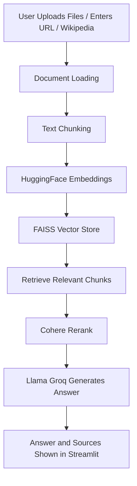

# RAG App: Streamlit + LangChain + Llama (Groq) + HuggingFace + Cohere

## Overview

This project is a Retrieval-Augmented Generation (RAG) application built with Streamlit and LangChain. It allows users to upload PDF or TXT files, enter a URL, or specify a Wikipedia topic, and then ask questions about the content. The app leverages HuggingFace embeddings, FAISS vector store, Cohere Rerank, and Llama (via Groq) to provide accurate, context-aware answers.

## Features

- Upload up to 2 files (PDF or TXT) at a time
- Load content from a URL or Wikipedia topic
- Ask questions about the uploaded or loaded documents
- Semantic search using HuggingFace embeddings and FAISS
- Reranking of retrieved results with Cohere for improved accuracy
- Answers generated by Llama (Groq API)
- Secure API key management using a .env file
- Chat history maintained for each document session

## Workflow



## Setup

1. Clone the repository.
2. Install dependencies:
   ```bash
   pip install -r requirements.txt
   ```
3. Create a `.env` file in the project root with your API keys:
   ```env
   GROQ_API_KEY=your_groq_api_key
   COHERE_API_KEY=your_cohere_api_key
   ```
   You can obtain your API keys from [Groq](https://console.groq.com/) and [Cohere](https://dashboard.cohere.com/api-keys).

## Usage

Run the Streamlit app:
```bash
streamlit run app.py
```

- Upload up to 2 PDF/TXT files, or enter a URL or Wikipedia topic.
- Click "Process Documents" to build the vector store.
- Ask a question and receive an answer with sources.

Note: Processing large Wikipedia articles or files may take some time due to embedding and indexing.

## Why Use This Project?

- Demonstrates modern RAG techniques, including retrieval, reranking, and LLM-based answering
- Clean and interactive UI with Streamlit
- Supports multiple document sources for flexible use cases
- Suitable for portfolios, technical demonstrations, and recruiter presentations

## Tech Stack

- Streamlit
- LangChain
- HuggingFace Transformers
- FAISS
- Cohere Rerank
- Groq Llama API

## License

MIT